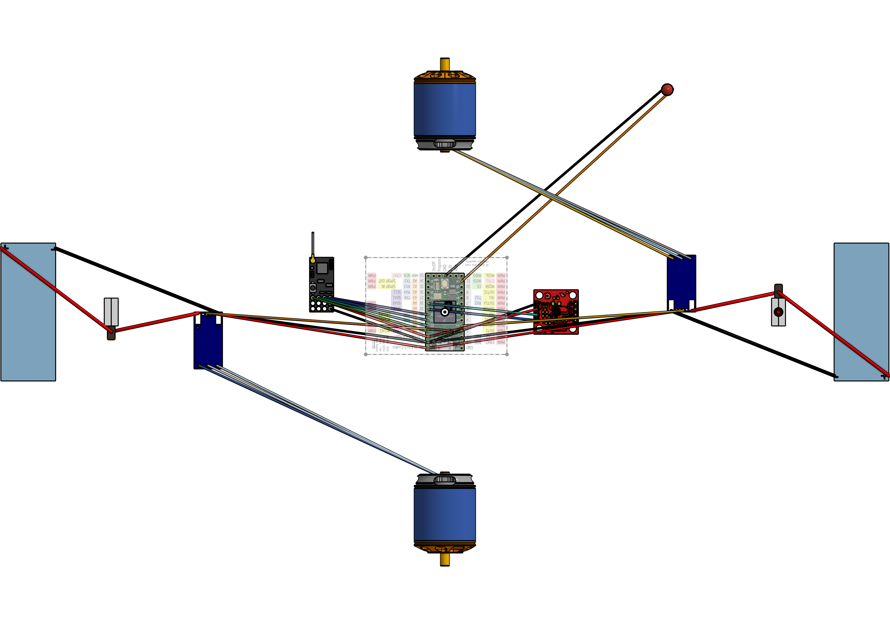

# Stuffed Crust

This repository contains the code for Wildcat Robotics' team Stuffed Crust. This is a fork of the [open source melty brain code](https://github.com/nothinglabs/openmelt2/tree/main), openmelt, with some changes specific to Stuffed Crust's design.

TODO:
- Add Mecanum Controls
- Open Melt's LEFTRIGHT is actually our Z_REVOLUTION
- Add accel_z to detect whether the robot is upside down or upside up (Open Melt only has `return xl.convertToG(ACCEL_MAX_SCALE, x)`)
- Watchdog

